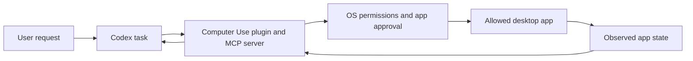

# Codex Computer Use: technical report

Research date: September 26, 2026

## Scope

This report covers Computer Use in the ChatGPT desktop app when the user selects Codex. OpenAI documents it as a local desktop capability, available on macOS and Windows in supported regions. It can inspect and operate graphical apps and local files after the user grants access. This is separate from Codex's ordinary coding tools, the browser extension, cloud tasks, and the Computer Use feature exposed to developers through the Responses API. [Computer Use documentation](https://learn.chatgpt.com/docs/computer-use)

## Summary

Computer Use gives Codex a route into local app interfaces for work that cannot be handled well through files, a command line, or a structured app integration. The desktop app bundles a Computer Use plugin with an MCP server and a skill. The operating system supplies the permissions needed to capture app content and control its interface. Codex then works through the selected app and returns the result for review.

The user experience differs by operating system. On macOS, Computer Use can run while the user works in other apps, with a live picture-in-picture preview of the app Codex is operating. On Windows, it runs on the active desktop and takes over foreground input. OpenAI's public documentation describes the behavior and required permissions, but does not publish the low-level implementation that draws the apparent second cursor or routes input in macOS background mode.

## How the desktop feature is wired

In the desktop app, Computer Use is a plugin that includes a local MCP server and a Computer Use skill. The skill tells Codex when and how to use the tool. The MCP server provides the connection to desktop control. Users enable the plugin and review which apps Codex may use in Settings. [Computer Use setup](https://learn.chatgpt.com/docs/computer-use)

This is a logical view of the documented workflow, not a diagram of the private implementation:

On macOS, Screen Recording permission lets Computer Use capture the target app. Accessibility permission lets it interact with the app. The app-level approval is a separate control: Codex asks before it uses an app unless the user has saved an Always allow choice. Workspace administrators can also restrict app access. On Windows, the target app must remain visible on the active desktop; app decisions can be saved by application ID in the local Codex configuration. [Permissions and app controls](https://learn.chatgpt.com/docs/computer-use)

At the product level, OpenAI says Codex can operate allowed apps and return the result for review. The separate Computer Use API guide documents one way to build that loop: a model returns ordered UI actions, a local harness executes them, and the harness returns a screenshot for the next model turn. The API guide lists actions such as clicking, dragging, scrolling, typing, key presses, waits, and screenshots. That is a useful technical reference, but OpenAI does not say that the Codex desktop plugin uses that exact action handler internally. [Computer Use API guide](https://developers.openai.com/api/docs/guides/tools-computer-use)

The distinction matters. Product documentation establishes the supported behavior and permissions. It does not disclose whether the desktop controller relies on accessibility events, a virtual display, window-specific input routing, or a combination of mechanisms. Treat any description of those internals as an inference unless OpenAI publishes more detail.

## macOS background mode and the second cursor

On macOS, Codex can keep a Computer Use task running while the user switches to other apps. A floating picture-in-picture view shows the active app, and the user can open or move that preview. The preview can also attach to the desktop pet. This makes it possible to watch the task without keeping the target app in front. [Computer Use use case](https://learn.chatgpt.com/use-cases/use-your-computer-with-codex) [Pets and Computer Use preview](https://learn.chatgpt.com/docs/pets)

The public docs do not explain how the apparent second cursor is drawn. They do not say whether it is composited into the preview, rendered by the desktop app as an agent pointer, or produced by a lower-level cursor or display mechanism. The safe technical description is that it is a visible agent pointer associated with Computer Use; the docs do not establish that macOS has two independent hardware cursors. The agent still has permission to act on app state, so the visual separation should not be read as a separate copy of the app or as protection against conflicting edits.

OpenAI advises against running two Computer Use tasks against the same app at once because their actions can change the active window or app state. That warning also matters when a person is using the exact app Codex is changing. Background mode lets the person keep working elsewhere; it does not make the target app's state safe for simultaneous edits. [Computer Use use case](https://learn.chatgpt.com/use-cases/use-your-computer-with-codex)

Windows works differently. Computer Use runs on the active desktop and cannot stay in the background while the user continues using that same Windows session. The pointer and keyboard can move, and the target app must remain visible. OpenAI suggests using a Windows virtual machine if the user needs to keep using their main desktop during the task. [Computer Use documentation](https://learn.chatgpt.com/docs/computer-use)

There is a separate macOS option called Locked Use. When enabled, an Apple authorization plugin participates in the unlock flow so an active, trusted Computer Use task can continue after the Mac locks. The desktop is temporarily unlocked for that task and covered on every display. If local keyboard or pointer input is detected, the Mac relocks and automatic unlock pauses until the user unlocks it manually. Locked Use is not the same as ordinary background operation and is not a general-purpose remote unlock feature. [Locked Use details](https://learn.chatgpt.com/docs/computer-use)

## Background work means more than one thing

Computer Use background mode is about operating a local app while the user has another app in front. Codex also has long-running task modes, which let the agent continue toward a stopping condition while the user checks in or works elsewhere. In the desktop app, `/goal` starts a persistent goal that can be steered, paused, or resumed. Goal mode keeps the same sandbox and approval rules; it does not grant broader access. [Long-running work](https://learn.chatgpt.com/docs/long-running-work)

For coding tasks, worktrees let Codex run independent chats on separate checkouts of the same Git repository. A local worktree stays on the computer or remote development environment hosting that repository. Codex Cloud runs in an isolated cloud environment and cannot directly access local apps, files, or signed-in desktop browser sessions. Use Computer Use when the work itself needs a local GUI; use a goal, worktree, or cloud task when the work can proceed without taking control of a local app. [Worktrees](https://learn.chatgpt.com/docs/environments/git-worktrees) [Codex Cloud](https://learn.chatgpt.com/docs/cloud)

The Responses API also has a `background: true` option for asynchronous model responses that developers can poll. That is a separate API feature. It does not, by itself, create a local desktop session or grant access to a user's apps. [Background mode API guide](https://developers.openai.com/api/docs/guides/background)

## Behaviors and use cases

Computer Use fits work that depends on a graphical interface: testing a native app, reproducing a GUI-only bug, changing a setting available only through menus, or checking information in an app without a structured integration. It can also move a scoped task across more than one desktop app, such as reading notes and preparing a reply for review. [Computer Use use case](https://learn.chatgpt.com/use-cases/use-your-computer-with-codex)

For a signed-in browser profile, the product guidance is to start a separate browser task with `@Chrome`. The Chrome extension can work with the user's existing tabs, profile, and extensions. The built-in browser has its own browser state and is better suited to public sites or local development pages. If an app has a dedicated plugin or MCP integration, OpenAI recommends that structured route when it can provide the needed information or action. [Computer Use use case](https://learn.chatgpt.com/use-cases/use-your-computer-with-codex) [Browser documentation](https://learn.chatgpt.com/docs/browser)

Good prompts name the app, the part of the workflow Codex should handle, and what counts as done. For example: ask it to prepare a draft but not send it, or to inspect a tracker and report proposed updates without submitting them. OpenAI recommends asking before sending, buying, or making other important changes. The user can stop the task or take over the computer at any time. [Computer Use use case](https://learn.chatgpt.com/use-cases/use-your-computer-with-codex) [Safety guidance](https://learn.chatgpt.com/docs/computer-use)

## Operational limits and review points

Computer Use can expose the contents of the apps it opens to the task. OpenAI says the feature can process screen content, screenshots, menus, keyboard input, and clipboard state in the target app. Keep unrelated sensitive apps closed, approve only the apps needed, and review consequential changes before confirming them. File reads, edits, and shell commands continue to follow the task's separate sandbox and approval settings. [Safety guidance](https://learn.chatgpt.com/docs/computer-use)

Use these boundaries when choosing a mode:

| Need | Best fit | What to expect |
| --- | --- | --- |
| Operate a local Mac app while using other apps | Computer Use on macOS | Background operation with a live preview |
| Operate a local Windows app while away from the keyboard | Computer Use on Windows | Foreground control; use a VM to keep the main desktop free |
| Work in a signed-in Chrome profile | `@Chrome` | Existing profile and tabs, controlled through the browser extension |
| Continue a long coding objective | `/goal`, a worktree, or Codex Cloud | Agent work can continue without keeping a local app in front |
| Automate a supported app with reliable structured operations | Its plugin or MCP integration | More direct access than visual UI interaction |

## What is documented, and what remains unknown

OpenAI documents the operating-system support, plugin setup, permissions, app approvals, macOS preview, Windows foreground behavior, and the separate Locked Use flow. Its API documentation also explains a general screenshot-and-action pattern for computer-use integrations.

OpenAI does not publish the exact macOS background input mechanism or the rendering path for the second cursor. It also does not state that the Codex desktop plugin uses the API guide's exact action protocol. Those details are not necessary to use the feature safely, but they matter if someone is trying to describe its internals precisely.

## Primary sources

- [Computer Use documentation](https://learn.chatgpt.com/docs/computer-use)
- [Use your computer with ChatGPT](https://learn.chatgpt.com/use-cases/use-your-computer-with-codex)
- [Computer Use API guide](https://developers.openai.com/api/docs/guides/tools-computer-use)
- [Long-running work](https://learn.chatgpt.com/docs/long-running-work)
- [Worktrees](https://learn.chatgpt.com/docs/environments/git-worktrees)
- [Codex Cloud](https://learn.chatgpt.com/docs/cloud)
- [Background mode API guide](https://developers.openai.com/api/docs/guides/background)
